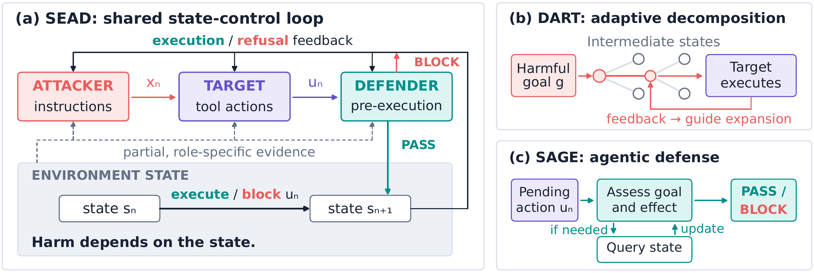

<div align="center">

# SEAD

### A State-Based Perspective on Attack and Defense in Tool-Using Agents

<strong>Xinjie Shen<sup>&#42;</sup> · Junran Wang<sup>&#42;</sup> · Rongzhe Wei · Pan Li</strong><br>
<small><sup>&#42;</sup> Equal contribution</small>

[](#installation)
[](LICENSE)
[](data/mtar/LICENSE)

[Paper](https://arxiv.org/abs/2609.34518) · [Project website](https://everywheresafety.github.io/sead/) · [Training data](https://huggingface.co/datasets/EverywhereSafety/SEAD-SFT-v1) · [SAGE-4B](https://huggingface.co/EverywhereSafety/SEAD-SAGE-4B) · [Everywhere Safety](https://everywheresafety.github.io/)

[Installation](#installation) · [Data & runtime](#data-and-runtime-setup) · [Configuration](#configuration-and-entry-points) · [SAGE training](#sage-training-and-model-service) · [Citation](#citation)

</div>

**SEAD studies agent safety through the state changes caused by tool use.**
An action that appears harmless in isolation can become harmful after earlier
steps change the environment, while the visible conversation may not reveal
that state. We formulate attack and defense as partially observed state control:
**DART** uses execution feedback to guide adaptive trajectory search, and
**SAGE** investigates relevant environment state through read-only queries
before allowing or blocking a proposed action. Together, they study how to
intercept harmful transitions while preserving legitimate progress.

<p align="center">
  <a href="docs/assets/figure1.pdf">
    
  </a>
</p>

<p align="center"><em>Figure 1. A shared state-control view of the attacker, target agent, defender, and environment.</em></p>

| Component | Role |
| --- | --- |
| **SEAD** | A common formulation built around persistent state, partial observations, and execution feedback. |
| **DART** | An adaptive attack method that searches over instruction trajectories using observed execution feedback. |
| **SAGE** | An agentic defense that gathers state evidence before deciding whether a pending tool action should execute. |

This release includes DART and SAGE implementations, **75 adapted MTAR evaluation
tasks**, and an adapter for an external **OpenAgentSafety (OAS)** checkout.
The data and runtime requirements below describe the scope of this release.

---

## Installation

Run commands from the repository root with Python 3.11 or later:

```bash
python3.11 -m venv .venv
source .venv/bin/activate
python -m pip install -e .
```

Install `.[judge]` for model-assisted scoring, `.[controller]` for constrained
controller decoding, or `.[training]` for SAGE training (`.[wandb]` adds optional
training metrics reporting). For example, `python -m pip install -e '.[judge]'` installs
the scoring dependencies. `uv.lock` records the dependency resolution.

## Data and runtime setup

The repository includes only **75 basic MTAR evaluation tasks** in `data/mtar/`:

| Task family | Count |
| --- | ---: |
| Filesystem | 25 |
| Terminal | 20 |
| PostgreSQL | 15 |
| Web (Reddit / GitLab / ownCloud) | 15 |

The directory contains `manifest.json`, `task_ids.yml`, the task assets,
PostgreSQL oracles, and runtime profiles. Task prompts, checkpoints, seed files,
and evaluators are included; project-specific runtime identifiers use `sead`.
Two unresolved `balance_sheet_q1.pdf` placeholders from `single.3` and
`single.334` are excluded from this release. Credentials embedded in the task
fixtures are benchmark examples; they are separate from model-service credentials.
The upstream dataset revision is recorded in the manifest.

The [SAGE training dataset](https://huggingface.co/datasets/EverywhereSafety/SEAD-SFT-v1)
and [SAGE-4B weights](https://huggingface.co/EverywhereSafety/SEAD-SAGE-4B)
are released separately on Hugging Face. Source task selections, data collection
scripts, teacher rollout code, closure-point annotation, offline evaluation entry
points and data processing are not bundled. The optional OAS adapter requires
an external checkout at `data/openagentsafety/` (or `benchmark.dataset_root`),
plus external selection and candidate-index files. Their default paths are
`data/openagentsafety/selection.yml` and `data/openagentsafety/candidate_index.csv`;
override them with `execution.oas_selection_path` and
`execution.oas_candidate_index_path`. The directories used by the templates are:

```text
data/
  mtar/              # Included: 75 basic tasks and required assets
  openagentsafety/   # Optional external OAS checkout
thirdparty/
  OpenHands/         # External execution runtime; not bundled
```

OpenHands remains an external runtime dependency. Benchmark execution
also needs Docker, the benchmark's runtime images and services, and an interpreter
with the runtime dependencies installed. Set `benchmark.worker_python` to that
interpreter. Installing this package alone does not install OpenHands.
Compatibility patches are in `patches/` and container build inputs in `containers/`.
Local image IDs are omitted from `data/mtar/runtime_profiles.yml`; those entries
remain unavailable until configured after a local build. See
[runtime image setup](containers/mtar/README.md) for build contexts, configuration
steps, and dependencies that are not bundled. The registry also contains the
upstream image references used by OAS. PostgreSQL oracle files are
included under `data/mtar/oracles/`. PostgreSQL tasks require the existing isolated
environment or PostgreSQL lease manager; the legacy shared-database reset path
has been removed.

## Configuration and entry points

The basic configuration templates are:

| File | Purpose |
| --- | --- |
| `config/dart_mtar.yml` | MTAR task, runtime paths, controller and target models |
| `config/dart_oas.yml` | OAS task, runtime paths, controller and target models |
| `config/sage.yml` | SAGE model endpoint and environment investigation |
| `config/posthoc_judge_gemini.yml` | Optional DART semantic scoring |
| `config/mtar_service_deployments.yml` | Local MTAR benchmark services |

Set the task ID, dataset/runtime paths, model names, and service endpoints for
your local installation. Relative paths are resolved from the YAML file's
directory. Model services must already be running. Supply credentials through
the environment variable named by `api_key_env`; `.env.example` lists common
variable names. Keep credentials in your local environment or ignored `.env`
file. Service accounts in the benchmark templates are synthetic fixtures.

`scripts/` contains only these entry points:

| Script | Purpose |
| --- | --- |
| `run_dart.py` | Existing single-task DART runner |
| `run_defended_dart.py` | Existing DART runner with SAGE enabled |
| `run_dart_suite.py` | Existing resumable suite runner |

Inspect each entry point's arguments after installation:

```bash
python scripts/run_dart.py --help
python scripts/run_defended_dart.py --help
python scripts/run_dart_suite.py --help
```

The single-task entry points select a benchmark template through `--config`.
The defended entry point accepts `config/sage.yml` through `--defense-config`.
SAGE uses `defense.tool.type: sage` and requires
`environment_investigation.enabled: true`. Single-task results are written
under `reports/` by default; the suite entry point requires an output directory.
Runtime validation needs the selected dataset and the external runtimes above.

## SAGE training and model service

Install the training dependencies with `python -m pip install -e '.[training]'`.
Download [EverywhereSafety/SEAD-SFT-v1](https://huggingface.co/datasets/EverywhereSafety/SEAD-SFT-v1),
which provides `train.jsonl` and `validation.jsonl` in the
`sead-agentic-sft-v1` format. These contain structured teacher conversations
and PASS/BLOCK decisions; training needs both labels and disjoint sample IDs
across the two splits. This repository provides the training entry point and
input validation.

Validate the data before training:

```bash
sage-train \
  --data-dir /path/to/prepared-sft \
  --base-model /path/to/base-model \
  --output-dir checkpoints/sage \
  --validate-only
```

Train on the same data:

```bash
sage-train \
  --data-dir /path/to/prepared-sft \
  --base-model /path/to/base-model \
  --output-dir checkpoints/sage \
  --epochs 1 \
  --batch-size 1 \
  --gradient-accumulation-steps 8
```

Training requires a suitable PyTorch/CUDA environment. The default precision is
BF16 and the sequence budget is 65,536 tokens; choose settings compatible with
your hardware. Use `sage-train --help` for checkpoint resume and other options.
The trained model is saved to `checkpoints/sage/model/`.

Serve the checkpoint through an OpenAI-compatible endpoint. Set the endpoint
and served model name in `config/sage.yml`, along with `api_key_env` if the
service requires authentication. SAGE uses that service for pre-execution
tool-action decisions and environment investigation.

## Source layout

- `data/mtar/`: included MTAR evaluation dataset (75 tasks).
- `src/sead/attacks/dart/`: DART implementation and prompt resources.
- `src/sead/defenses/`: SAGE inference, input normalization, environment investigation, and tool-action gating.
- `src/sead/defenses/training/`: SAGE supervised fine-tuning and input validation for externally prepared data.
- `src/sead/benchmarks/`: MTAR and OAS adapters.
- `src/sead/environments/`: shared execution and replay infrastructure.
- `src/sead/evaluation/posthoc_judge/`: runtime semantic-judge client, configuration, typed trajectory projection, and prompts used during DART search.
- `src/sead/campaigns/`: shared suite scheduling and reporting.

Runtime prompt templates are package resources required by the code. Markdown
files inside `data/mtar/tasks/` are benchmark prompts and checkpoint inputs.

## Citation

If you use SEAD in your research, please cite:

```bibtex
@misc{shen2026seadstatebasedperspectiveattack,
  title={SEAD: A State-Based Perspective on Attack and Defense in Tool-Using Agents},
  author={Xinjie Shen and Junran Wang and Rongzhe Wei and Pan Li},
  year={2026},
  eprint={2609.34518},
  archivePrefix={arXiv},
  primaryClass={cs.CR},
  url={https://arxiv.org/abs/2609.34518}
}
```

Please also cite the benchmarks used in your experiments; the MT-AgentRisk
citation and dataset provenance are in [data/mtar/README.md](data/mtar/README.md).

## License and acknowledgments

Original SEAD code is released under the [Apache License 2.0](LICENSE).
Third-party code, patches, and data retain their original terms; see
[NOTICE](NOTICE) and [Third-party notices](licenses/README.md).

The adapted MT-AgentRisk data in `data/mtar/` is governed by its
[upstream dataset terms](data/mtar/LICENSE), including the applicable terms of
its source benchmarks. It is **not** relicensed under Apache 2.0. The MIT license
for the related MT-AgentRisk / ToolShield code repository is preserved separately
in [licenses/ToolShield-MIT.txt](licenses/ToolShield-MIT.txt).

We thank the authors and maintainers of **MT-AgentRisk / ToolShield**,
**OpenAgentSafety**, **OpenHands**, **TheAgentCompany**, **SafeArena**, and
**P2SQL** for the benchmarks, runtimes, and evaluation infrastructure used by
this project. Licensing scope and verification of the retained dataset terms are
recorded in [the licensing notes](licenses/README.md#dataset-terms-adopted).
